# AMPLIFIER (52)
|No.|Name|based on|Visuals|
|---|---|---|---|
|||||
|01|59 TWEED BASS|Fender® ’59 Bassman||  
|02|59 TWEED DELUXE|Fender® Tweed Deluxe|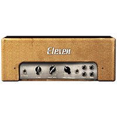|
|03|59 DELUXE GAIN MOD|Fender® Tweed Deluxe (Gain Mod)|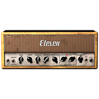|
|04|59 TWEED PRINCE|Fender® ’59 Princeton||
|05|64 BLACK LUX NORM|Fender® Deluxe Reverb (Normal)||
|06|64 BLACK LUX VIB|Fender® Deluxe Reverb (Vibrato)||
|07|64 BLACK VIB|Fender® Vibroverb|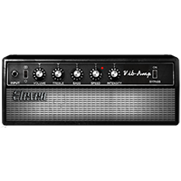|
|08|65 BLACK MINI|Fender® Champ 6w||
|09|65 BLACK PRINCE|Fender® Princeton|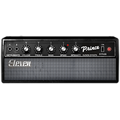|
|10|65 BLACK PRINCE REV|Fender® Princeton Reverb|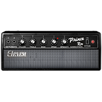|
|11|65 BLACK SR|Fender® Super Reverb "Blackface"|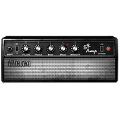|
|12|67 BLACK DUO|Fender® Twin Reverb "Blackface"||
|13|67 BLACK SHIMMER|Fender® Dual Showman|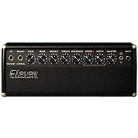|
|14|66 AC Hi BOOST|66 AC HI BOOST MOD|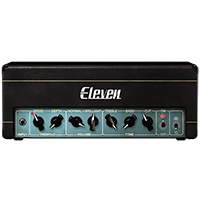|
|15|66 AC HI BOOST MOD|Vox® AC30 Top Boost (Mod)|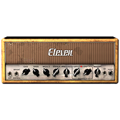|
|16|66 FLIP BASS|Ampeg® Portaflex B15-N|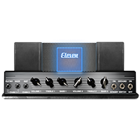|
|17|69 BLUE LINE BASS|Ampeg® SVT 300w|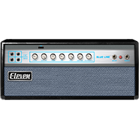|
|18|69 BLUE LINE SCOOP|Ampeg® SVT 300w (Scooped)||
|19|65 J45|Marshall® JTM45|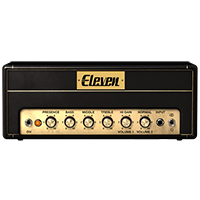|
|20|67 PLEXIGLAS VARI|Marshall® Super Lead Plexi (Variac Mod)||
|21|68 PLEXI EL84 MOD|Marshall® Super Lead Plexi (EL34 tubes mod)|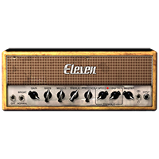|
|22|69 PLEXIGLAS 100W|Marshall® Super Lead Plexi 100W|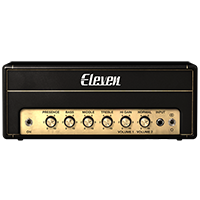|
|23|68 PLEXIGLAS 50W|Marshall® Super Lead Plexi 50W||
|24|82 LEAD 800 100W|Marshall® JCM800 (Normal)|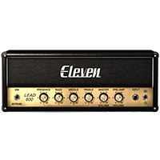|
|25|82 LEAD 800 50W|Marshall® JCM800 50w||
|26|82 LEAD 800 BASS MOD|Marshall® JCM800 (Bass Mod)||
|27|82 LEAD 800 BRIGHT|Marshall® JCM800 (Bright)|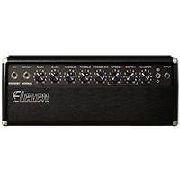|
|28|82 LEAD 800 TS MOD|Marshall® JCM800 (TS Mod)||
|29|83 400R|Gallien-Krueger® 800RB|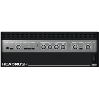|
|30|84 J-120H|Roland® Jazz Chorus 120 (Head)||
|31|85 M-2 LEAD|Mesa/Boogie® Mark IIc+ (Drive)|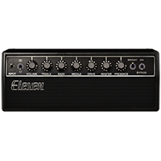|
|32|85 M-2 LEAD CAP MOD|Mesa/Boogie® Mark IIc+ (Coupling Cap Mod)||
|33|92 TREADPLATE MODERN|Mesa/Boogie® Dual Rectifier (Modern)|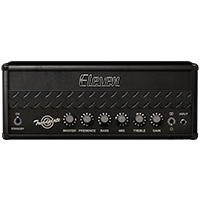|
|34|92 TREADPLATE RAW|Mesa/Boogie® Dual Rectifier (Raw)||
|35|92 TREADPLATE VINTAGE|Mesa/Boogie® Dual Rectifier (Vintage)|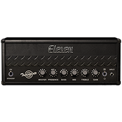|
|36|93 MS30|Matchless® DC30|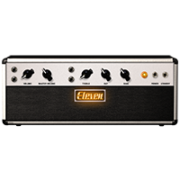|
|37|99 PV51 II CLEAN|Peavey® 5150 II (Clean)||
|38|99 PV51 II CRUNCH|Peavey® 5150 II (Crunch)||
|39|99 PV51 II LEAD|Peavey® 5150 II (Lead)||
|40|97 RB-01B GREEN|Bogner® Ecstasy 101B (Green Channel)|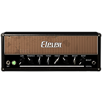|
|41|97 RB-01B BLUE|Bogner® Ecstasy 101B (Blue Channel)|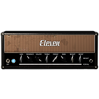|
|42|97 RB-01B RED|Bogner® Ecstasy 101B (Red Channel)||
|43|89 SL-100 CLEAN|Soldano® SLO-100 (Clean)|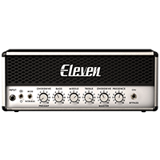|
|44|89 SL-100 CRUNCH|Soldano® SLO-100 (Crunch)||
|45|89 SL-100 DRIVE|Soldano® SLO-100 (Drive)|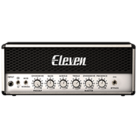|
|46|89 SL-100 EXT RANGE|Soldano® SLO-100 (Extreme)||
|47|Tangerine 30 Channel 1|Orange® AD30HTC ® Clean Channel||
|48|Tangerine 30 Channel 2|Orange® AD30HTC ® Dirty Channel||
|49|11 EPB II HI-LEAD|2011 ENGL® Powerball II||
|50|11 EPB II LO-LEAD|2011 ENGL® Powerball II||
|51|11 EPB II CRUNCH|2011 ENGL® Powerball II||
|52|11 EPB II CLEAN|2011 ENGL® Powerball II|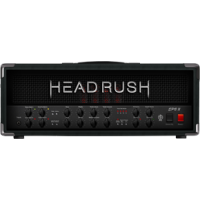|
