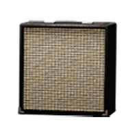
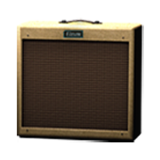
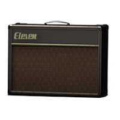

# CABINET (15)
|No.|Name|based on|Visuals|
|---|---|---|---|
|||||
|01|1X8 CUSTOM|Fender® Champ||
|02|1X12 BLACK PANEL LUX|Fender® Deluxe Reverb “Blackface” (Jensen P12N)||
|03|1X12 TWEED LUX|Fender® Tweed Deluxe (Jensen P12Q)||
|04|1X15 OPEN BACK|Ampeg® Reverberocket (Jensen C15N)||
|05|2X12 AC BLUE|Vox® AC30 (Celestion Alnico Blue)||
|06|2X12 BLACK PANEL DUO|Fender® Twin Reverb “Blackface” (Jensen C12N)||
|07|2X12 B30|Bogner® (Celestion V30)||
|08|2X12 SILVER CONE|Roland® JC-120||
|09|4X10 TWEED BASS|Fender® ’59 Bassman (Jensen P10Q)||
|10|4X10 BLACK SR|Fender® Super Reverb “Blackface” (CTS Alnico)||
|11|4X12 CLASSIC 30W|Marshall® 1960AV (Celestion V30)||
|12|4X12 65W|Marshall® (Celestion G12-65)||
|13|4X12 GREEN 25W|Marshall® 1960A (Celestion G12-H “Greenback”)||
|14|4X12 GREEN 20W|Marshall® (Celestion G12- M)||
|15|8X10 BLUE LINE|Ampeg® SVT “Blueline” (Towel Bar)||