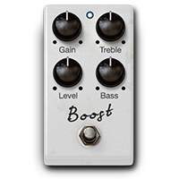
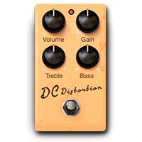
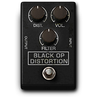
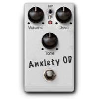
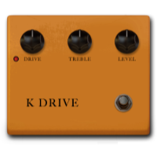
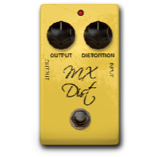
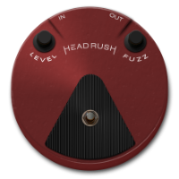
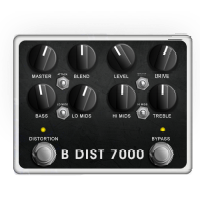

# Distorion (16)
|No.|Name|based on|Visuals|
|---|---|---|---|
|||||
|01|WHITE BOOST|Xotic® RC Booster||
|02|GREEN JRC-OD|Ibanez® TS808||
|03|DC DISTORT|Avid® Custom Distortion (Eleven Rack)||
|04|BLACK OP|ProCo® Rat||
|05|TRI FUZZ|EHX® Big Muff Pi||
|06|8-BIT CRUSH|OTO® Biscuit||
|07|ANXIETY OD|Fulltone® OCD||
|08|ANXIETY OD V2|Fulltone® OCD||
|09|D1 Distortion|Boss® DS-1||
|10|K DRIVE|Klon® Centaur||
|11|MX Dist|MXR® Distortion||
|12|Round Fuzz|Dunlop® Fuzz Face||
|13|B DIST 7000|Darkglass® Microtubes B7K Ultra V2 Bass Preamp||
|14|OCT FUZZ|Dunlop® JH-OC1 Octavio||
|15|D250 DRIVE|DOD® Overdrive Preamp 250||
|16|S1 DRIVE|Boss® SD-1 Super Overdrive||