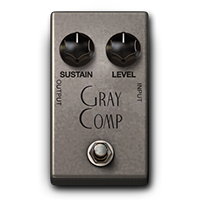
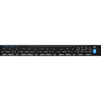
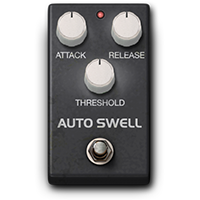

# DYNAMICS/EQ (10)
|No.|Name|based on|Visuals|
|---|---|---|---|
|||||
|01|GRAY COMP|Ross® Compressor||
|02|DYN111 COMP|Avid® Dynamic III Comp (Plug-in)||
|03|GRAPHIC EQ|Avid® Custom Graphic EQ (Eleven Rack)||
|04|PARA EQ|Avid® Custom Parametric EQ (Eleven Rack)||
|05|BASS EQ|Avid® Custom EQ (Eleven Rack)||
|06|GATE|Rocktron® Hush The Pedal (Based on)||
|07|AUTOSWELL|Digitech® Crescendo (Based on)||
|08|NOISE FILTER|Noise Filter (Headrush® Original)||
|09|SIDE COMP|Side Comp (HeadRush® Original)||
|10|HOLD|Based on Electro-Harmonix® Freeze||