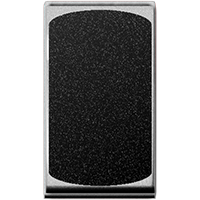
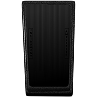
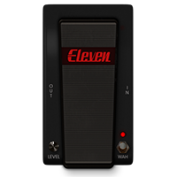
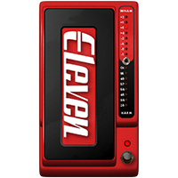
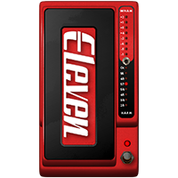
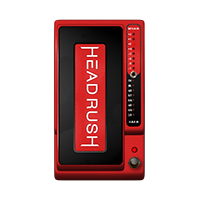
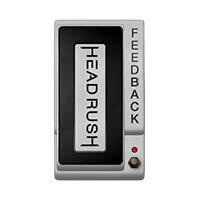

# EXPRESSION (10)
|No.|Name|based on|Visuals|
|---|---|---|---|
|||||
|01|VOLUME|Ernie Ball® Volume Pedal||
|02|SHINE WAH|Vox® V486||
|03|BLACK WAH|MXR® Cry Baby||
|04|MORE WAH|Morley® Wah||
|05|PANNER|Avid® Panner (Eleven Rack)||
|06|WHAM|Digitech® Whammy (Classic)||
|07|HARM|Digitech® Whammy (Harmonizer)||
|08|CHORD WHAM|Digitech® Whammy (Poliphonic)||
|09|FEEDBACK|Feedbacker (Headrush® Original)||
|10|TIME WARP|Digitech® Space Station (Warp Mode)||