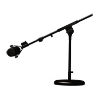
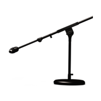
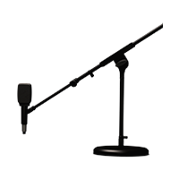
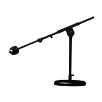
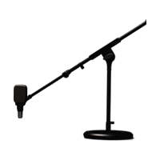
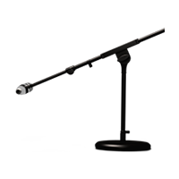
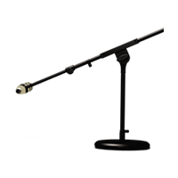
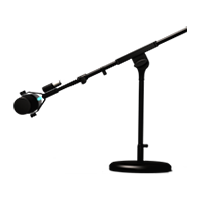

# Microphone (10)
|No.|Name|based on|Visuals|
|---|---|---|---|
|||||
|01|DYN 7|Shure® SM7||
|02|DYN 57|Shure® SM57||
|03|DYN 409|Sennheiser® MD409||
|04|DYN 421|Sennheiser® MD421||
|05|COND 67|Neumann® U67||
|06|COND 87|Neumann® U87||
|07|COND 414|AKG® C414 XLS||
|08|RIBBON 121|Royer® 121||
|09|DYN 20|Electro-Voice® RE20||
|10|DYN 12|AKG® D112||