# MODULATION (22)
|No.|Name|based on|Visuals|
|---|---|---|---|
|||||
|01|MULTICHORUS|Avid® AIR Multichorus (Plug-in)||
|02|CHORUS|Boss® CE-1 (Chorus Mode)|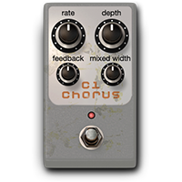|
|03|FLANGER|TC Electronic® Thunderstorm||
|04|VIBRATO|Boss® CE-1 (Vibrato Mode)||
|05|AIR FILTER|Pro Tools® AIR Filter (Plug- in)|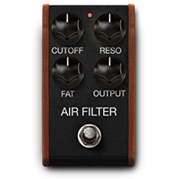|
|06|AIR FLANGER|Pro Tools® AIR Flanger (Plug-in)|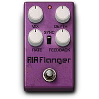|
|07|AIR VIBRATO|Pro Tools® AIR Vibrato (Plug-in)|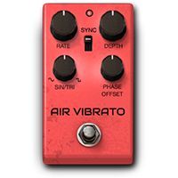|
|08|VIBE PHASER|Uni-Vibe®|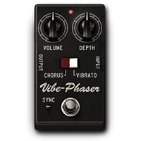|
|09|ORANGE PHASER|MXR® Phase 90||
|10|TRON PHASER|Mu-Tron® Phasor II||
|11|STONE PHASER|EHX ®Small Stone|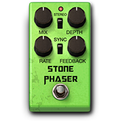|
|12|ROTARY|Avid® Rotary Module (Plug- in)|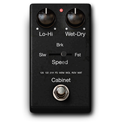|
|13|TREMOLO|Boss® TR-2|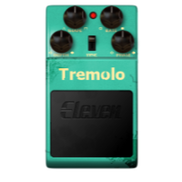|
|14|OCTAVES|Boss® OC-2|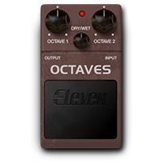|
|15|SMART HARM|Smart Harmonizer (Headrush Original)|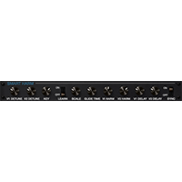|
|16|TRON FILTER|Mu-Tron® III Envelope Filter|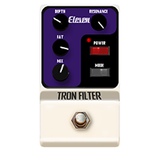|
|17|RING MOD|Moog® Ring Modulator||
|18|DROP TUNE|Digitech® Drop||
|19|Acoustic Sim|Boss® Acoustic Simulator||
|20|Detune|Detune (HeadRush® Original)|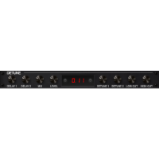|
|21|Octaves Up|OCTAVES UP (HeadRush® Original)||
|22|ENV FILTER|DOD® FX25 Envelope Filter||