# HeadrushMX5
# MODELS
## AMPLIFIER (52)
|No.|Name|based on|Visuals|
|---|---|---|---|
|01|59 TWEED BASS|Fender® ’59 Bassman||  
|02|59 TWEED DELUXE|Fender® Tweed Deluxe|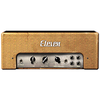|
|03|59 DELUXE GAIN MOD|Fender® Tweed Deluxe (Gain Mod)|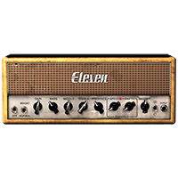|
|04|59 TWEED PRINCE|Fender® ’59 Princeton||
|05|64 BLACK LUX NORM|Fender® Deluxe Reverb (Normal)||
|06|64 BLACK LUX VIB|Fender® Deluxe Reverb (Vibrato)||
|07|64 BLACK VIB|Fender® Vibroverb|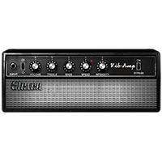|
|08|65 BLACK MINI|Fender® Champ 6w||
|09|65 BLACK PRINCE|Fender® Princeton|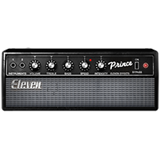|
|10|65 BLACK PRINCE REV|Fender® Princeton Reverb|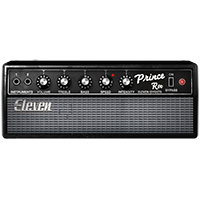|
|11|65 BLACK SR|Fender® Super Reverb "Blackface"|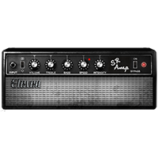|
|12|67 BLACK DUO|Fender® Twin Reverb "Blackface"||
|13|67 BLACK SHIMMER|Fender® Dual Showman|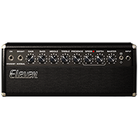|
|14|66 AC Hi BOOST|66 AC HI BOOST MOD|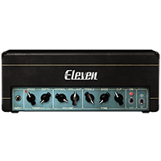|
|15|66 AC HI BOOST MOD|Vox® AC30 Top Boost (Mod)|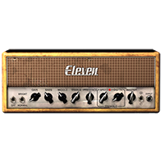|
|16|66 FLIP BASS|Ampeg® Portaflex B15-N|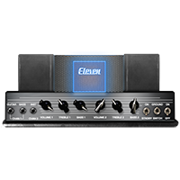|
|17|69 BLUE LINE BASS|Ampeg® SVT 300w|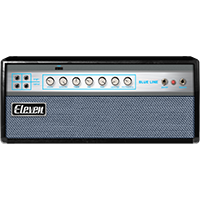|
|18|69 BLUE LINE SCOOP|Ampeg® SVT 300w (Scooped)||
|19|65 J45|Marshall® JTM45|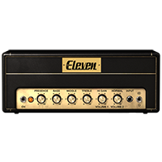|
|20|67 PLEXIGLAS VARI|Marshall® Super Lead Plexi (Variac Mod)||
|21|68 PLEXI EL84 MOD|Marshall® Super Lead Plexi (EL34 tubes mod)|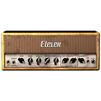|
|22|69 PLEXIGLAS 100W|Marshall® Super Lead Plexi 100W|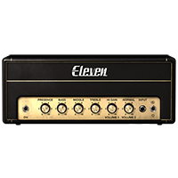|
|23|68 PLEXIGLAS 50W|Marshall® Super Lead Plexi 50W||
|24|82 LEAD 800 100W|Marshall® JCM800 (Normal)|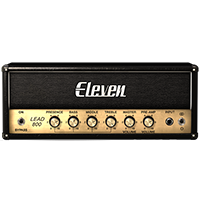|
|25|82 LEAD 800 50W|Marshall® JCM800 50w||
|26|82 LEAD 800 BASS MOD|Marshall® JCM800 (Bass Mod)||
|27|82 LEAD 800 BRIGHT|Marshall® JCM800 (Bright)||
|28|82 LEAD 800 TS MOD|Marshall® JCM800 (TS Mod)||
|29|83 400R|Gallien-Krueger® 800RB|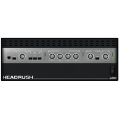|
|30|84 J-120H|Roland® Jazz Chorus 120 (Head)||
|31|85 M-2 LEAD|Mesa/Boogie® Mark IIc+ (Drive)||
|32|85 M-2 LEAD CAP MOD|Mesa/Boogie® Mark IIc+ (Coupling Cap Mod)||
|33|92 TREADPLATE MODERN|Mesa/Boogie® Dual Rectifier (Modern)|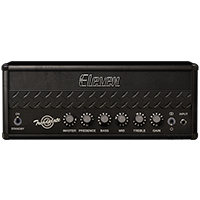|
|34|92 TREADPLATE RAW|Mesa/Boogie® Dual Rectifier (Raw)||
|35|92 TREADPLATE VINTAGE|Mesa/Boogie® Dual Rectifier (Vintage)|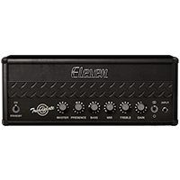|
|36|93 MS30|Matchless® DC30|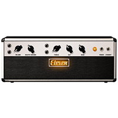|
|37|99 PV51 II CLEAN|Peavey® 5150 II (Clean)||
|38|99 PV51 II CRUNCH|Peavey® 5150 II (Crunch)||
|39|99 PV51 II LEAD|Peavey® 5150 II (Lead)||
|40|97 RB-01B GREEN|Bogner® Ecstasy 101B (Green Channel)|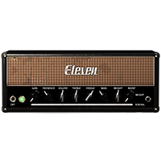|
|41|97 RB-01B BLUE|Bogner® Ecstasy 101B (Blue Channel)|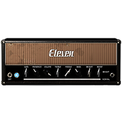|
|42|97 RB-01B RED|Bogner® Ecstasy 101B (Red Channel)||
|43|89 SL-100 CLEAN|Soldano® SLO-100 (Clean)|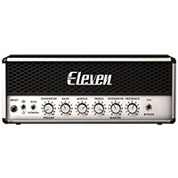|
|44|89 SL-100 CRUNCH|Soldano® SLO-100 (Crunch)||
|45|89 SL-100 DRIVE|Soldano® SLO-100 (Drive)|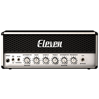|
|46|89 SL-100 EXT RANGE|Soldano® SLO-100 (Extreme)||
|47|Tangerine 30 Channel 1|Orange® AD30HTC ® Clean Channel||
|48|Tangerine 30 Channel 2|Orange® AD30HTC ® Dirty Channel||
|49|11 EPB II HI-LEAD|2011 ENGL® Powerball II||
|50|11 EPB II LO-LEAD|2011 ENGL® Powerball II||
|51|11 EPB II CRUNCH|2011 ENGL® Powerball II||
|52|11 EPB II CLEAN|2011 ENGL® Powerball II||

## CABINET (15)
|No.|Name|based on|Visuals|
|---|---|---|---|
|01|1X8 CUSTOM|Fender® Champ||
|02|1X12 BLACK PANEL LUX|Fender® Deluxe Reverb “Blackface” (Jensen P12N)|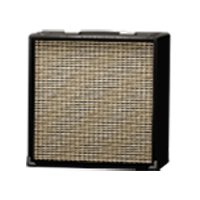|
|03|1X12 TWEED LUX|Fender® Tweed Deluxe (Jensen P12Q)|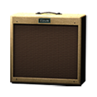|
|04|1X15 OPEN BACK|Ampeg® Reverberocket (Jensen C15N)||
|05|2X12 AC BLUE|Vox® AC30 (Celestion Alnico Blue)|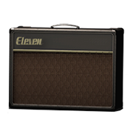|
|06|2X12 BLACK PANEL DUO|Fender® Twin Reverb “Blackface” (Jensen C12N)||
|07|2X12 B30|Bogner® (Celestion V30)||
|08|2X12 SILVER CONE|Roland® JC-120||
|09|4X10 TWEED BASS|Fender® ’59 Bassman (Jensen P10Q)||
|10|4X10 BLACK SR|Fender® Super Reverb “Blackface” (CTS Alnico)||
|11|4X12 CLASSIC 30W|Marshall® 1960AV (Celestion V30)||
|12|4X12 65W|Marshall® (Celestion G12-65)||
|13|4X12 GREEN 25W|Marshall® 1960A (Celestion G12-H “Greenback”)||
|14|4X12 GREEN 20W|Marshall® (Celestion G12- M)||
|15|8X10 BLUE LINE|Ampeg® SVT “Blueline” (Towel Bar)||

## Microphone (10)
|No.|Name|based on|Visuals|
|---|---|---|---|
|01|DYN 7|Shure® SM7|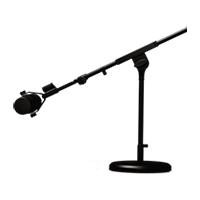|
|02|DYN 57|Shure® SM57|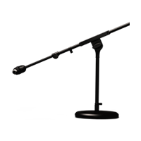|
|03|DYN 409|Sennheiser® MD409|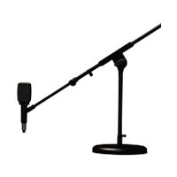|
|04|DYN 421|Sennheiser® MD421|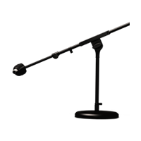|
|05|COND 67|Neumann® U67||
|06|COND 87|Neumann® U87||
|07|COND 414|AKG® C414 XLS||
|08|RIBBON 121|Royer® 121|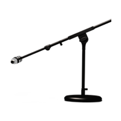|
|09|DYN 20|Electro-Voice® RE20||
|10|DYN 12|AKG® D112|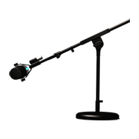|

## Distorion (16)
|No.|Name|based on|Visuals|
|---|---|---|---|
|01|WHITE BOOST|Xotic® RC Booster|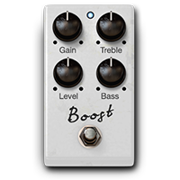|
|02|GREEN JRC-OD|Ibanez® TS808||
|03|DC DISTORT|Avid® Custom Distortion (Eleven Rack)|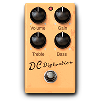|
|04|BLACK OP|ProCo® Rat|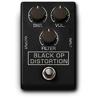|
|05|TRI FUZZ|EHX® Big Muff Pi||
|06|8-BIT CRUSH|OTO® Biscuit||
|07|ANXIETY OD|Fulltone® OCD||
|08|ANXIETY OD V2|Fulltone® OCD|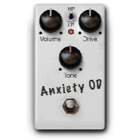|
|09|D1 Distortion|Boss® DS-1||
|10|K DRIVE|Klon® Centaur||
|11|MX Dist|MXR® Distortion|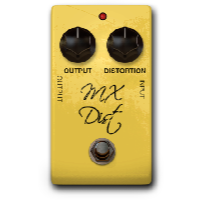|
|12|Round Fuzz|Dunlop® Fuzz Face|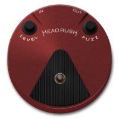|
|13|B DIST 7000|Darkglass® Microtubes B7K Ultra V2 Bass Preamp|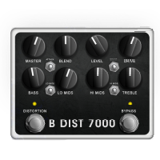|
|14|OCT FUZZ|Dunlop® JH-OC1 Octavio||
|15|D250 DRIVE|DOD® Overdrive Preamp 250||
|16|S1 DRIVE|Boss® SD-1 Super Overdrive||

## DYNAMICS/EQ (10)
|No.|Name|based on|Visuals|
|---|---|---|---|
|01|GRAY COMP|Ross® Compressor|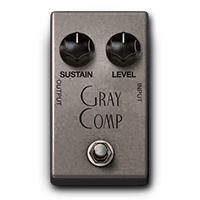|
|02|DYN111 COMP|Avid® Dynamic III Comp (Plug-in)||
|03|GRAPHIC EQ|Avid® Custom Graphic EQ (Eleven Rack)||
|04|PARA EQ|Avid® Custom Parametric EQ (Eleven Rack)|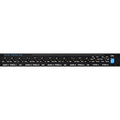|
|05|BASS EQ|Avid® Custom EQ (Eleven Rack)||
|06|GATE|Rocktron® Hush The Pedal (Based on)||
|07|AUTOSWELL|Digitech® Crescendo (Based on)|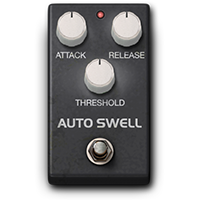|
|08|NOISE FILTER|Noise Filter (Headrush® Original)||
|09|SIDE COMP|Side Comp (HeadRush® Original)||
|10|HOLD|Based on Electro-Harmonix® Freeze||

## MODULATION (22)
|No.|Name|based on|Visuals|
|---|---|---|---|
|01|MULTICHORUS|Avid® AIR Multichorus (Plug-in)||
|02|CHORUS|Boss® CE-1 (Chorus Mode)|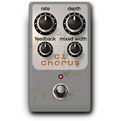|
|03|FLANGER|TC Electronic® Thunderstorm||
|04|VIBRATO|Boss® CE-1 (Vibrato Mode)||
|05|AIR FILTER|Pro Tools® AIR Filter (Plug- in)|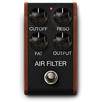|
|06|AIR FLANGER|Pro Tools® AIR Flanger (Plug-in)|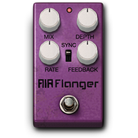|
|07|AIR VIBRATO|Pro Tools® AIR Vibrato (Plug-in)|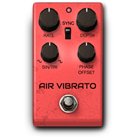|
|08|VIBE PHASER|Uni-Vibe®|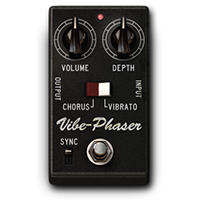|
|09|ORANGE PHASER|MXR® Phase 90||
|10|TRON PHASER|Mu-Tron® Phasor II||
|11|STONE PHASER|EHX ®Small Stone|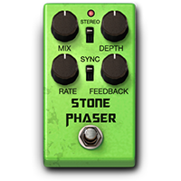|
|12|ROTARY|Avid® Rotary Module (Plug- in)|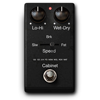|
|13|TREMOLO|Boss® TR-2|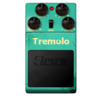|
|14|OCTAVES|Boss® OC-2||
|15|SMART HARM|Smart Harmonizer (Headrush Original)||
|16|TRON FILTER|Mu-Tron® III Envelope Filter||
|17|RING MOD|Moog® Ring Modulator||
|18|DROP TUNE|Digitech® Drop||
|19|Acoustic Sim|Boss® Acoustic Simulator||
|20|Detune|Detune (HeadRush® Original)||
|21|Octaves Up|OCTAVES UP (HeadRush® Original)||
|22|ENV FILTER|DOD® FX25 Envelope Filter||

## REVERB/DELAY (13)
|No.|Name|based on|Visuals|
|---|---|---|---|
|01|STEREO DOUBLER|Stereo Doubler (HeadRush® Original)||
|02|AIR REVERB|Pro Tools® AIR Reverb (Plug-in)||
|03|ELEVEN REVERB|Avid® Reverb One (Eleven Rack)||
|04|SPRING REVERB|Fender® Spring Reverb||
|05|TAPE ECHO|Maestro® Echoplex EP-3||
|06|BBD DELAY|EHX® Deluxe Memory Man||
|07|DYN DELAY|Pro Tools® AIR Dynamic Delay (Plug-in)||
|08|SHIMMER|Shimmer Reverb (Headrush® Original)||
|09|AIR DELAY|Pro Tools® AIR Delay (Plug-in)||
|10|REVERSE DELAY|Boss® DD-5||
|11|PITCH DELAY|Boss® PS-3||
|12|AMBI VERB|AMBI VERB (Headrush® Original)||
|13|RESO DELAY|RESO DELAY (HeadRush® Original)||

## EXPRESSION (10)
|No.|Name|based on|Visuals|
|---|---|---|---|
|01|VOLUME|Ernie Ball® Volume Pedal||
|02|SHINE WAH|Vox® V486||
|03|BLACK WAH|MXR® Cry Baby||
|04|MORE WAH|Morley® Wah||
|05|PANNER|Avid® Panner (Eleven Rack)||
|06|WHAM|Digitech® Whammy (Classic)||
|07|HARM|Digitech® Whammy (Harmonizer)||
|08|CHORD WHAM|Digitech® Whammy (Poliphonic)||
|09|FEEDBACK|Feedbacker (Headrush® Original)||
|10|TIME WARP|Digitech® Space Station (Warp Mode)||