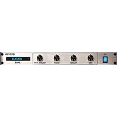
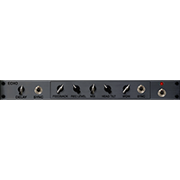
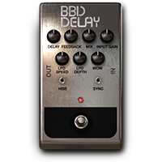
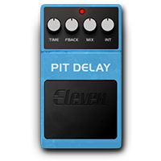

# REVERB/DELAY (13)
|No.|Name|based on|Visuals|
|---|---|---|---|
|||||
|01|STEREO DOUBLER|Stereo Doubler (HeadRush® Original)||
|02|AIR REVERB|Pro Tools® AIR Reverb (Plug-in)||
|03|ELEVEN REVERB|Avid® Reverb One (Eleven Rack)||
|04|SPRING REVERB|Fender® Spring Reverb||
|05|TAPE ECHO|Maestro® Echoplex EP-3||
|06|BBD DELAY|EHX® Deluxe Memory Man||
|07|DYN DELAY|Pro Tools® AIR Dynamic Delay (Plug-in)||
|08|SHIMMER|Shimmer Reverb (Headrush® Original)||
|09|AIR DELAY|Pro Tools® AIR Delay (Plug-in)||
|10|REVERSE DELAY|Boss® DD-5||
|11|PITCH DELAY|Boss® PS-3||
|12|AMBI VERB|AMBI VERB (Headrush® Original)||
|13|RESO DELAY|RESO DELAY (HeadRush® Original)||